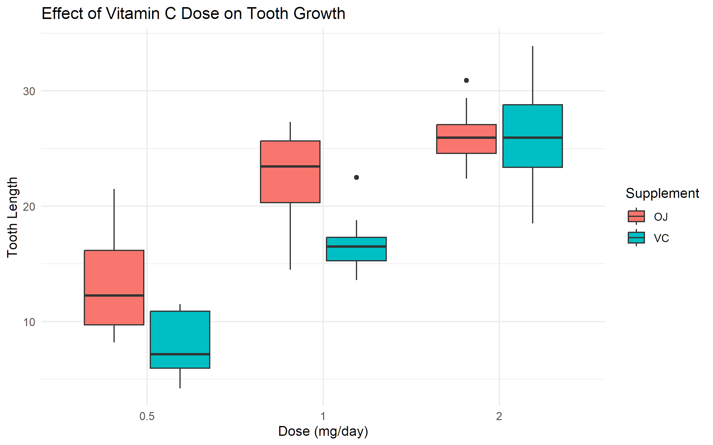

# Statistical Inference Practice Project using R

Author: Ruel Barredo Laranjo  
Original Exercise: 2022  
Portfolio Update: 2026  

## Project Overview
This project was completed as a guided exercise from a statistical inference course using R programming.

The project includes:

- Simulation of exponential distributions
- Demonstration of the Central Limit Theorem
- Exploratory Data Analysis
- Hypothesis testing using the ToothGrowth dataset

## Visualization

The following boxplot illustrates the effect of Vitamin C dosage on tooth growth.

## Dataset
The ToothGrowth dataset contains observations on tooth growth in guinea pigs receiving different doses of Vitamin C through two delivery methods: orange juice (OJ) and ascorbic acid (VC).

## Key Findings
- Supplement type does not significantly affect tooth growth.
- Higher Vitamin C doses significantly increase tooth growth.

## Skills Demonstrated
- R Programming
- Statistical Inference
- Data Visualization
- Hypothesis Testing
- Exploratory Data Analysis

## Learning Context
This project was completed as a guided exercise from a statistical 
